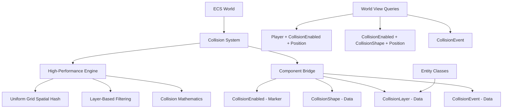

# Collision Components Design Guide

This guide explains how the collision components integrate with your existing ECS architecture, following your established patterns while providing high-performance collision detection.

## Architecture Overview

The collision system is designed in two layers:

1. **High-Performance Core**: `systems/collision/` - Optimized collision detection engine
2. **ECS Components**: `components/collision_component.py` - ECS-friendly component wrappers

This separation allows the collision engine to remain optimized while providing an ECS-friendly interface.

## ECS Component Patterns

Your existing ECS system uses these patterns:

### Component Categories

**Data Components**: Store data
```python
@dataclass(frozen=True)
class Position:
    x: float
    y: float

@dataclass(frozen=True)  
class Velocity:
    vx: float
    vy: float
```

**Marker Components**: Pure identifiers
```python
@dataclass(frozen=True)
class PlayerControlled:
    pass
```

**Game Components**: Game-specific data
```python
@dataclass(frozen=True)
class HeldItem:
    item_id: str
```

### Collision Components Follow This Pattern

**Data Components**:
- `CollisionShape(diameter, layer, offset_x, offset_y, is_trigger)` - Collision data
- `CollisionLayer(entity_class, custom_layer)` - Layer configuration
- `CollisionEvent(entity_a, entity_b, normal_x, normal_y, penetration)` - Event data
- `CollisionSettings(enabled, collision_callback, lod_enabled, lod_distance)` - Configuration

**Marker Components**:
- `CollisionEnabled()` - Enables collision for entity

**Component Templates**:
- `CollisionTemplates` - Factory methods for common configurations

## Integration with Entity Classes

The collision system integrates seamlessly with your `components/entity_classes.py`:

```python
from components.entity_classes import Player, Mob, NPC, Plant, Object

# CollisionLayer automatically assigns layers based on entity class
world.add(entity, CollisionLayer(entity_class=Player))  # Uses PLAYER layer
world.add(entity, CollisionLayer(entity_class=Mob))     # Uses ENEMIES layer
world.add(entity, CollisionLayer(entity_class=Object))  # Uses WALLS layer
```

## Query Patterns

The collision components work with your existing `World.view()` patterns:

### Basic Queries
```python
# All entities with collision
entities = world.entities_with(CollisionEnabled)

# Entities with collision and position
for entity, collision_shape, position in world.view(CollisionEnabled, CollisionShape, Position):
    # Process collision-enabled entities
    pass

# Player entities with collision
for entity, player, collision_shape, position in world.view(Player, CollisionEnabled, CollisionShape, Position):
    # Process player collision
    pass
```

### Event Handling
```python
# Collision events
for entity, event in world.view(CollisionEvent):
    if event.collision_type == "enter":
        handle_collision_start(event)
```

## Component Relationships

```
Entity
├── Position (required for collision)
├── Velocity (optional, for movement systems)
├── [CollisionEnabled] (marker - enables collision)
├── [CollisionShape] (data - collision properties)
├── [CollisionLayer] (data - layer configuration)
├── [CollisionSettings] (data - collision configuration)
└── [CollisionEvent] (data - collision events)
```

## Performance Integration

### Efficient Queries
```python
# Efficient: Only query needed components
for entity, position in world.view(CollisionEnabled, Position):
    # Process collision-enabled entities
    pass

# Less efficient: Extra component queries
for entity, position, velocity in world.view(CollisionEnabled, Position, Velocity):
    # Unnecessary Velocity query if not needed
    pass
```

### Batch Processing
```python
def collision_movement_system(world, delta_time):
    """Process all collision-enabled entities efficiently"""
    
    # Single query, multiple systems can use this pattern
    for entity, collision_shape, position in world.view(CollisionEnabled, CollisionShape, Position):
        velocity = world.get(entity, Velocity)
        if velocity:
            position.x += velocity.vx * delta_time
            position.y += velocity.vy * delta_time
```

## System Design Patterns

### Player-Focused Systems
```python
def player_input_system(world, input_handler):
    """Only affects player entities with collision"""
    for entity, player, position, collision_shape in world.view(Player, CollisionEnabled, Position, CollisionShape):
        # System only processes entities that are:
        # 1. Player entities
        # 2. Have collision enabled
        # 3. Have a position
        # 4. Have a collision shape
        move_input = input_handler.get_movement(entity)
        velocity = world.get(entity, Velocity)
        if velocity:
            velocity.vx = move_input.x * 100.0
            velocity.vy = move_input.y * 100.0
```

### Event-Driven Systems
```python
def collision_event_system(world):
    """Handle collision events as components"""
    for entity, event in world.view(CollisionEvent):
        # Process collision event
        if event.collision_type == "enter":
            handle_new_collision(event)
        elif event.collision_type == "exit":
            handle_ended_collision(event)
        
        # Remove event after processing
        world.remove(entity, CollisionEvent)
```

### Component-Based Configuration
```python
def collision_optimization_system(world):
    """Optimize collision based on settings"""
    for entity, settings in world.view(CollisionSettings):
        if not settings.enabled:
            # Skip entities with collision disabled
            continue
            
        if settings.lod_enabled:
            # Apply LOD optimization
            position = world.get(entity, Position)
            if position:
                apply_lod_optimization(entity, position, settings.lod_distance)
```

## Memory and Performance

### Component Memory Usage
- `CollisionEnabled`: 0 bytes (marker)
- `CollisionShape`: ~32 bytes (diameter, layer, offsets, flags)
- `CollisionLayer`: ~24 bytes (entity_class reference, layer bitmask)
- `CollisionEvent`: ~40 bytes (entity IDs, collision data)
- `CollisionSettings`: ~32 bytes (settings and callbacks)

### Query Optimization
The collision components are designed for optimal query performance:

1. **Selective Queries**: Only query components you need
2. **Minimal Component Creation**: Use `CollisionEnabled` as a cheap filter
3. **Event Component Cleanup**: Remove `CollisionEvent` after processing
4. **Layer-Based Filtering**: Use collision layers to reduce unnecessary checks

## System Architecture



## Migration Guide

### Adding Collision to Existing Entities

**Before** (entity without collision):
```python
player = entity_manager.create()
world.add(player, Position(100, 200))
world.add(player, Velocity(0, 0))
# No collision
```

**After** (entity with collision):
```python
player = entity_manager.create()
world.add(player, Position(100, 200))
world.add(player, Velocity(0, 0))

# Add collision using convenience function
add_collision_to_entity(world, player, entity_class=Player, diameter=32)
```

### Converting Existing Systems

**Before** (traditional collision checking):
```python
def movement_system(world, delta_time):
    for entity in all_entities:  # Iterate all entities
        position = world.get(entity, Position)
        velocity = world.get(entity, Velocity)
        # Manual collision checking
        if check_collision(entity, position):
            # Handle collision
            pass
```

**After** (component-based collision):
```python
def movement_system(world, delta_time):
    # Only process entities with collision enabled
    for entity, position in world.view(CollisionEnabled, Position):
        velocity = world.get(entity, Velocity)
        # Collision handled by collision system
        if velocity:
            position.x += velocity.vx * delta_time
            position.y += velocity.vy * delta_time
```

## Best Practices

### 1. Component Organization
- Use `CollisionEnabled` to filter entities cheaply
- Query only the components you need
- Remove collision components when entities are destroyed

### 2. System Design
- Separate movement from collision handling
- Use event components for reaction-based systems
- Leverage layer-based filtering for performance

### 3. Performance Optimization
- Use batch operations for position updates
- Clean up unused collision events
- Apply LOD based on `CollisionSettings`

### 4. Integration Patterns
- Follow your existing system naming conventions
- Use `World.view()` patterns consistently
- Let collision system handle physics, let game logic handle responses

## Testing and Debugging

### Component Verification
```python
def verify_collision_components(world):
    """Check that collision entities are properly configured"""
    
    for entity, collision_shape in world.view(CollisionEnabled, CollisionShape):
        # Verify position exists
        position = world.get(entity, Position)
        assert position is not None, f"Entity {entity} has collision but no position"
        
        # Verify collision layers
        assert collision_shape.layer != 0, f"Entity {entity} has collision but layer=0"
```

### Performance Monitoring
```python
def collision_performance_monitor(world):
    """Monitor collision system performance"""
    
    collision_entities = len(world.entities_with(CollisionEnabled))
    active_events = len(world.entities_with(CollisionEvent))
    
    print(f"Collision entities: {collision_entities}")
    print(f"Active collision events: {active_events}")
    
    # Alert if performance drops
    if active_events > collision_entities * 2:
        print("WARNING: High collision event count")
```

This collision component system seamlessly integrates with your existing ECS patterns while providing the high-performance collision detection needed for your game.