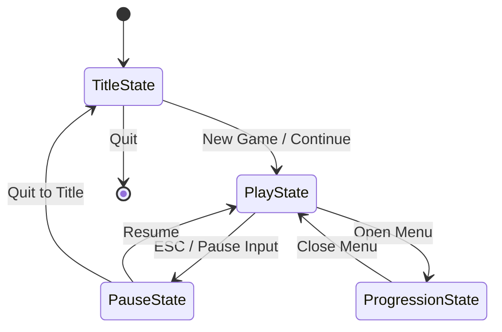

# Project Introduction: The Dark Lord of Crafting

Welcome to the codebase! This document provides a high-level overview of the project structure, architecture, and key systems to help you get started.

## 1. Introduction

**The Dark Lord of Crafting** is a 2D game built using Python and `pygame-ce`. It features a custom Entity-Component-System (ECS) architecture for gameplay logic, a robust state management system, and a service-oriented architecture for non-ECS concerns like asset loading and UI.

**Tech Stack:**
- **Language:** Python 3.10+
- **Engine:** `pygame-ce` (Community Edition)
- **Architecture:** Custom ECS (`ecs_core`), State Pattern (`states`), Service Locator pattern (`services`)

## 2. Entry Point & Main Loop

The application entry point is [`main.py`](main.py). It initializes the `StateManager` and starts the main game loop.

### `StateManager` (`states/state_manager.py`)
The `StateManager` is the central hub of the application. It:
- Initializes global services (Display, Audio).
- Manages the active game state (Title, Play, Pause, Progression).
- Runs the core loop: `handle_events()`, `update()`, `render()`.

## 3. Game State Flow

The game transitions between different states, each managing its own logic and rendering.



- **TitleState**: Main menu, new game, settings.
- **PlayState**: The core gameplay loop. Initializes the ECS world and runs systems.
- **PauseState**: Pauses the game time but keeps the `PlayState` rendered in the background.
- **ProgressionState**: Upgrade menu for player stats.

## 4. Architecture Overview

### ECS (Entity-Component-System)
The gameplay logic within `PlayState` is driven by a custom ECS implementation located in `ecs_core/`.

- **World (`ecs_core/worlds/world.py`)**: The database of all entities and their components.
- **Entities**: Simple integer IDs.
- **Components (`ecs_core/components/`)**: Data containers (e.g., `Position`, `Velocity`, `Health`).
- **Systems (`ecs_core/systems_base.py`)**: Logic processors that operate on entities with specific components (e.g., `MovementSystem` updates `Position` based on `Velocity`).

### Services
Non-gameplay concerns are handled by services located in `services/`. These are often initialized by `PlayState` or `StateManager` and injected where needed.

- **Asset Loader**: Loads images, sounds, and data files.
- **Audio Package**: Manages sound effects and music.
- **UI Manager**: Handles in-game UI elements.
- **Time Manager**: Controls game time, day/night cycles, and pausing.

## 5. Directory Map

```
c:/1_dlc_unity/apotheosis_now/
├── main.py                 # Entry point
├── ecs_core/               # ECS Framework
│   ├── components/         # Component definitions
│   ├── systems/            # System logic
│   └── worlds/             # World management
├── states/                 # Game States
│   ├── play/               # Core gameplay state
│   ├── title_state/        # Main menu
│   ├── pause_state/        # Pause screen
│   └── progression_state/  # Upgrade menu
├── services/               # Shared Services
│   ├── asset_loader/       # Resource management
│   ├── audio_package/      # Sound system
│   ├── crafting/           # Crafting logic
│   ├── inventory/          # Inventory management
│   ├── monster_factory/    # Entity spawning
│   └── ...
├── data/                   # JSON data files (Entities, Items, Dialogues)
└── docs/                   # Detailed documentation
```

## 6. Key Documentation

For deeper dives into specific systems, refer to these documents:

- **[ECS & PlayState Overview](docs/ecs_playstate_overview.md)**: Detailed explanation of how the ECS is wired into the `PlayState`.
- **[Component Master List](docs/component_master.md)**: Reference for all available ECS components.
- **[Entity Movement](docs/entity_movement.md)**: How movement and physics are handled.
- **[Legacy Wiring](services/player_legacy/legacy_wiring.md)**: Information on legacy player systems.

## 7. Input Handling

Input is handled via a mix of Pygame events and a custom `PlayInputBus`.

- **Global Events**: `StateManager` handles `QUIT` and `VIDEORESIZE`.
- **Gameplay Input**: `PlayState` routes events to the `PlayInputBus`, which systems can subscribe to.
- **UI Input**: UI components often handle their own input events (clicks, hovers).

**Rule**: Avoid polling `pygame.key.get_pressed()` in update loops. Use event-driven input handling.